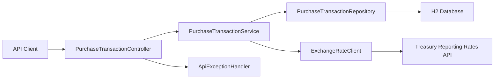

# WEX Corporate Payments

Java 21 / Spring Boot API implementation of the WEX corporate payments.

## What it does

- Stores a purchase transaction with validation for description length, date format, and positive USD amount.
- Persists transactions locally with an embedded database for development, while higher environments are configured for external database settings.
- Retrieves a stored purchase converted to a Treasury-supported `countryCurrency` using the latest exchange rate on or before the purchase date within the prior 6 months.
- Returns clear API errors for validation failures, missing purchases, unavailable conversions, and Treasury API issues.

## High-level architecture



## API

### Create purchase

`POST /api/purchases`

```json
{
  "description": "Hotel",
  "transactionDate": "2026-03-10",
  "purchaseAmount": 123.45
}
```

Response:

```json
{
  "id": "f5d41893-8867-4c4b-a117-e297704f8a59",
  "description": "Hotel",
  "transactionDate": "2026-03-10",
  "purchaseAmountUsd": 123.45
}
```

### Retrieve converted purchase

`GET /api/purchases/{purchaseId}?countryCurrency=Canada-Dollar`

Response:

```json
{
  "id": "f5d41893-8867-4c4b-a117-e297704f8a59",
  "description": "Hotel",
  "transactionDate": "2026-03-10",
  "originalPurchaseAmountUsd": 123.45,
  "countryCurrency": "Canada-Dollar",
  "exchangeRateDate": "2026-02-28",
  "exchangeRate": 1.4234,
  "convertedAmount": 175.72
}
```

## Running locally

Set `JAVA_HOME` to your installed JDK 21, then run:

```bash
export JAVA_HOME=$(/usr/libexec/java_home -v 21)
./mvnw spring-boot:run
```

If Maven Wrapper is not present, use:

```bash
export JAVA_HOME=$(/usr/libexec/java_home -v 21)
mvn spring-boot:run
```

Run tests:

```bash
export JAVA_HOME=$(/usr/libexec/java_home -v 21)
mvn test
```

To manually test endpoints, trigger the request files under `http/` from your IDE HTTP client or REST client plugin. Start with `http/create-purchase-transactions/success.http`, then copy the returned purchase `id` into the GET request files under `http/get-purchase-tranactions/`.

The H2 console is available at `/h2-console` for local development when the local profile is used.

## Health checks

The application exposes Spring Boot Actuator health endpoints for the database and Treasury upstream API.

Available endpoints:

- `GET /actuator/health`
- `GET /actuator/health/readiness`
- `GET /actuator/info`

Example aggregate health response:

```json
{
  "status": "UP",
  "components": {
    "db": {
      "status": "UP"
    },
    "treasuryApi": {
      "status": "UP",
      "details": {
        "upstream": "Treasury Reporting Rates API",
        "statusCode": 200
      }
    }
  }
}
```

You can verify locally after starting the app:

```bash
curl http://localhost:8080/actuator/health
curl http://localhost:8080/actuator/health/readiness
```

## Running tests

Run the full test suite:

```bash
export JAVA_HOME=$(/usr/libexec/java_home -v 21)
mvn test
```

Run only the BDD / Gherkin scenarios:

```bash
export JAVA_HOME=$(/usr/libexec/java_home -v 21)
mvn -Dtest=CucumberTest test
```

Generate a JaCoCo coverage report:

```bash
export JAVA_HOME=$(/usr/libexec/java_home -v 21)
mvn org.jacoco:jacoco-maven-plugin:0.8.12:prepare-agent test org.jacoco:jacoco-maven-plugin:0.8.12:report
```

Then open the generated HTML report at `target/site/jacoco/index.html`.

BDD feature files live under `src/test/resources/features`, and the executable Cucumber runner is `src/test/java/com/wex/payments/bdd/CucumberTest.java`.

## Design notes

- `countryCurrency` is intentionally modeled after Treasury’s `country_currency_desc` field and should be provided in Treasury-style `Country-Currency` format such as `India-Rupee`.
- Exchange rate lookup uses the latest rate whose record month is on or before the purchase date and within the preceding 6 months.
- Purchase amounts are normalized to two decimal places with half-up rounding before persistence.

## Folder structure

```text
corporate-payments/
├── http/                                         # Manual endpoint and actuator requests
├── src/main/java/com/wex/payments/
│   ├── config/                                  # Spring bean and client configuration
│   ├── constants/                               # Shared constants and validation patterns
│   ├── controller/                              # REST endpoints and exception handling
│   ├── domain/                                  # JPA entities
│   ├── dto/                                     # Request and response models
│   ├── exception/                               # Domain-specific exceptions
│   ├── health/                                  # Actuator custom health indicators
│   ├── logging/                                 # Trace and MDC logging support
│   ├── repository/                              # Spring Data repositories
│   └── service/                                 # Business logic and Treasury integration
├── src/main/resources/                          # Default and environment-specific configuration
└── src/test/
    ├── java/com/wex/payments/
    │   ├── bdd/                                 # Executable Gherkin step definitions and test config
    │   ├── controller/                          # Controller-level tests
    │   └── service/                             # Service and integration-focused tests
    └── resources/features/                      # Gherkin feature files
```
