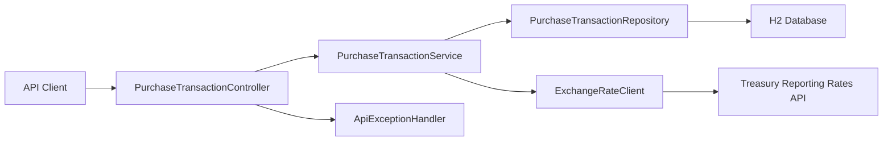

# WEX Corporate Payments

Java 21 / Spring Boot API implementation of the WEX corporate payments.

## What it does

- Stores a purchase transaction with validation for description length, date format, and positive USD amount.
- Persists transactions in an embedded H2 database, so the app runs without installing a separate database.
- Retrieves a stored purchase converted to a Treasury-supported `countryCurrency` using the latest exchange rate on or before the purchase date within the prior 6 months.
- Returns clear API errors for validation failures, missing purchases, unavailable conversions, and Treasury API issues.

## High-level architecture



## API

### Create purchase

`POST /api/purchases`

```json
{
  "description": "Hotel",
  "transactionDate": "2026-03-10",
  "purchaseAmount": 123.45
}
```

Response:

```json
{
  "id": "f5d41893-8867-4c4b-a117-e297704f8a59",
  "description": "Hotel",
  "transactionDate": "2026-03-10",
  "purchaseAmountUsd": 123.45
}
```

### Retrieve converted purchase

`GET /api/purchases/{purchaseId}?countryCurrency=Canada-Dollar`

Response:

```json
{
  "id": "f5d41893-8867-4c4b-a117-e297704f8a59",
  "description": "Hotel",
  "transactionDate": "2026-03-10",
  "originalPurchaseAmountUsd": 123.45,
  "countryCurrency": "Canada-Dollar",
  "exchangeRateDate": "2026-02-28",
  "exchangeRate": 1.4234,
  "convertedAmount": 175.72
}
```

## Running locally

Set `JAVA_HOME` to your installed JDK 21, then run:

```bash
export JAVA_HOME=$(/usr/libexec/java_home -v 21)
./mvnw spring-boot:run
```

If Maven Wrapper is not present, use:

```bash
export JAVA_HOME=$(/usr/libexec/java_home -v 21)
mvn spring-boot:run
```

Run tests:

```bash
export JAVA_HOME=$(/usr/libexec/java_home -v 21)
mvn test
```

The H2 console is available at `/h2-console` while the app is running.

## Running tests

Run the full test suite:

```bash
export JAVA_HOME=$(/usr/libexec/java_home -v 21)
mvn test
```

Run only the BDD / Gherkin scenarios:

```bash
export JAVA_HOME=$(/usr/libexec/java_home -v 21)
mvn -Dtest=CucumberTest test
```

BDD feature files live under `src/test/resources/features`, and the executable Cucumber runner is `src/test/java/com/wex/payments/bdd/CucumberTest.java`.

## Design notes

- `countryCurrency` is intentionally modeled after Treasury’s `country_currency_desc` field to avoid ambiguity when multiple countries or currencies have similar names.
- Exchange rate lookup uses the latest rate whose record month is on or before the purchase date and within the preceding 6 months.
- Purchase amounts are normalized to two decimal places with half-up rounding before persistence.

## Folder structure

```text
corporate-payments/
├── pom.xml                                      # Maven build and dependencies
├── README.md                                    # Project overview and setup notes
├── src/main/java/com/wex/payments/
│   ├── CorporatePaymentsApplication.java        # Spring Boot entry point
│   ├── config/
│   │   └── RestClientConfiguration.java         # Treasury RestClient bean
│   ├── constants/
│   │   ├── ApiConstants.java                    # API route and message constants
│   │   ├── TreasuryConstants.java               # Treasury integration constants
│   │   └── ValidationConstants.java             # Validation messages
│   ├── controller/
│   │   ├── ApiExceptionHandler.java             # Global exception-to-response mapping
│   │   └── PurchaseTransactionController.java   # REST endpoints
│   ├── domain/
│   │   └── PurchaseTransaction.java             # Purchase JPA entity
│   ├── dto/
│   │   ├── ApiErrorResponse.java                # Error response payload
│   │   ├── ConvertedPurchaseTransactionResponse.java
│   │   │                                         # Converted purchase response
│   │   ├── CreatePurchaseTransactionRequest.java
│   │   │                                         # Create purchase request
│   │   └── PurchaseTransactionResponse.java     # Stored purchase response
│   ├── exception/
│   │   ├── CurrencyConversionNotAvailableException.java
│   │   │                                         # Missing conversion rate error
│   │   ├── PurchaseNotFoundException.java       # Purchase not found error
│   │   └── UpstreamExchangeRateException.java   # Treasury upstream error
│   ├── logging/
│   │   ├── LoggingConstants.java                # MDC and trace header keys
│   │   └── RequestTracingFilter.java            # Trace ID and request lifecycle logging
│   ├── repository/
│   │   └── PurchaseTransactionRepository.java   # JPA repository
│   └── service/
│       ├── ExchangeRateClient.java              # Treasury exchange-rate lookup
│       ├── ExchangeRateQuote.java               # Selected exchange-rate value object
│       └── PurchaseTransactionService.java      # Core business logic
├── src/main/resources/
│   ├── application.yml                          # Default app and logging config
│   ├── application-local.yml                    # Local overrides
│   ├── application-preprod.yml                  # Preprod overrides
│   └── application-prod.yml                     # Prod overrides
└── src/test/
    ├── java/com/wex/payments/
    │   ├── bdd/
    │   │   ├── BddScenarioContext.java          # Scenario state holder
    │   │   ├── BddTestConfiguration.java        # BDD test beans
    │   │   ├── CucumberSpringConfiguration.java # Spring context for Cucumber
    │   │   ├── CucumberTest.java                # BDD test runner
    │   │   ├── PurchaseTransactionBddSteps.java # Gherkin step definitions
    │   │   └── StubExchangeRateClient.java      # Test double for Treasury calls
    │   ├── controller/
    │   │   └── PurchaseTransactionControllerTest.java
    │   │                                         # Controller tests
    │   └── service/
    │       ├── ExchangeRateClientTest.java      # Exchange-rate client tests
    │       └── PurchaseTransactionServiceTest.java
    │                                                 # Service tests
    └── resources/features/
        ├── retrieve_converted_purchase_transaction.feature
        │                                         # BDD scenarios for conversion retrieval
        └── store_purchase_transaction.feature    # BDD scenarios for purchase creation
```
