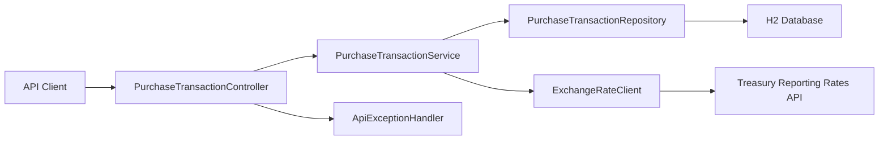

# WEX Corporate Payments

Java 21 / Spring Boot API implementation of the WEX corporate payments.

## What it does

- Stores a purchase transaction with validation for description length, date format, and positive USD amount.
- Persists transactions in an embedded H2 database, so the app runs without installing a separate database.
- Retrieves a stored purchase converted to a Treasury-supported `countryCurrency` using the latest exchange rate on or before the purchase date within the prior 6 months.
- Returns clear API errors for validation failures, missing purchases, unavailable conversions, and Treasury API issues.

## High-level architecture



## API

### Create purchase

`POST /api/purchases`

```json
{
  "description": "Hotel",
  "transactionDate": "2026-03-10",
  "purchaseAmount": 123.45
}
```

Response:

```json
{
  "id": "f5d41893-8867-4c4b-a117-e297704f8a59",
  "description": "Hotel",
  "transactionDate": "2026-03-10",
  "purchaseAmountUsd": 123.45
}
```

### Retrieve converted purchase

`GET /api/purchases/{purchaseId}?countryCurrency=Canada-Dollar`

Response:

```json
{
  "id": "f5d41893-8867-4c4b-a117-e297704f8a59",
  "description": "Hotel",
  "transactionDate": "2026-03-10",
  "originalPurchaseAmountUsd": 123.45,
  "countryCurrency": "Canada-Dollar",
  "exchangeRateDate": "2026-02-28",
  "exchangeRate": 1.4234,
  "convertedAmount": 175.72
}
```

## Running locally

Set `JAVA_HOME` to your installed JDK 21, then run:

```bash
export JAVA_HOME=$(/usr/libexec/java_home -v 21)
./mvnw spring-boot:run
```

If Maven Wrapper is not present, use:

```bash
export JAVA_HOME=$(/usr/libexec/java_home -v 21)
mvn spring-boot:run
```

Run tests:

```bash
export JAVA_HOME=$(/usr/libexec/java_home -v 21)
mvn test
```

The H2 console is available at `/h2-console` while the app is running.

## Running tests

Run the full test suite:

```bash
export JAVA_HOME=$(/usr/libexec/java_home -v 21)
mvn test
```

Run only the BDD / Gherkin scenarios:

```bash
export JAVA_HOME=$(/usr/libexec/java_home -v 21)
mvn -Dtest=CucumberTest test
```

BDD feature files live under `src/test/resources/features`, and the executable Cucumber runner is `src/test/java/com/wex/payments/bdd/CucumberTest.java`.

## Design notes

- `countryCurrency` is intentionally modeled after Treasury’s `country_currency_desc` field to avoid ambiguity when multiple countries or currencies have similar names.
- Exchange rate lookup uses the latest rate whose record month is on or before the purchase date and within the preceding 6 months.
- Purchase amounts are normalized to two decimal places with half-up rounding before persistence.

## Folder structure

### Root

- `pom.xml`: Maven build, dependencies, and test runner configuration.
- `README.md`: Project overview, setup, test instructions, and structure reference.

### Main application code

- `src/main/java/com/wex/payments/CorporatePaymentsApplication.java`: Spring Boot entry point.

### Configuration

- `src/main/java/com/wex/payments/config/RestClientConfiguration.java`: Creates the `RestClient` used for Treasury API calls.

### Constants

- `src/main/java/com/wex/payments/constants/ApiConstants.java`: Centralizes API route and response message constants.
- `src/main/java/com/wex/payments/constants/TreasuryConstants.java`: Holds Treasury API field names, date rules, and integration constants.
- `src/main/java/com/wex/payments/constants/ValidationConstants.java`: Contains validation error messages shared across the API.

### Controllers

- `src/main/java/com/wex/payments/controller/ApiExceptionHandler.java`: Maps exceptions into consistent HTTP error responses.
- `src/main/java/com/wex/payments/controller/PurchaseTransactionController.java`: Exposes create and retrieve purchase REST endpoints.

### Domain

- `src/main/java/com/wex/payments/domain/PurchaseTransaction.java`: JPA entity representing a stored purchase transaction.

### DTOs

- `src/main/java/com/wex/payments/dto/ApiErrorResponse.java`: Response model for API error payloads.
- `src/main/java/com/wex/payments/dto/ConvertedPurchaseTransactionResponse.java`: Response model for converted purchase retrieval.
- `src/main/java/com/wex/payments/dto/CreatePurchaseTransactionRequest.java`: Request model for creating a purchase transaction.
- `src/main/java/com/wex/payments/dto/PurchaseTransactionResponse.java`: Response model for a stored purchase transaction.

### Exceptions

- `src/main/java/com/wex/payments/exception/CurrencyConversionNotAvailableException.java`: Signals that no eligible exchange rate exists for conversion.
- `src/main/java/com/wex/payments/exception/PurchaseNotFoundException.java`: Signals that the requested purchase id does not exist.
- `src/main/java/com/wex/payments/exception/UpstreamExchangeRateException.java`: Signals a Treasury API failure or malformed upstream response.

### Repository

- `src/main/java/com/wex/payments/repository/PurchaseTransactionRepository.java`: Spring Data JPA repository for purchase persistence.

### Services

- `src/main/java/com/wex/payments/service/ExchangeRateClient.java`: Fetches and filters Treasury exchange rates.
- `src/main/java/com/wex/payments/service/ExchangeRateQuote.java`: Immutable value object for a selected exchange rate.
- `src/main/java/com/wex/payments/service/PurchaseTransactionService.java`: Applies business rules for storing and converting purchases.

### Application configuration files

- `src/main/resources/application.yml`: Default Spring Boot, H2, and Treasury API configuration.
- `src/main/resources/application-local.yml`: Local-environment overrides.
- `src/main/resources/application-preprod.yml`: Pre-production environment overrides.
- `src/main/resources/application-prod.yml`: Production environment overrides.

### Unit and controller tests

- `src/test/java/com/wex/payments/controller/PurchaseTransactionControllerTest.java`: Verifies controller request validation and HTTP responses.
- `src/test/java/com/wex/payments/service/ExchangeRateClientTest.java`: Verifies Treasury response parsing and exchange-rate selection logic.
- `src/test/java/com/wex/payments/service/PurchaseTransactionServiceTest.java`: Verifies purchase storage, rounding, and conversion behavior.

### BDD / Cucumber test support

- `src/test/java/com/wex/payments/bdd/BddScenarioContext.java`: Stores per-scenario request and response state for step definitions.
- `src/test/java/com/wex/payments/bdd/BddTestConfiguration.java`: Registers test-only beans used by the BDD suite.
- `src/test/java/com/wex/payments/bdd/CucumberSpringConfiguration.java`: Boots the Spring test context for Cucumber scenarios.
- `src/test/java/com/wex/payments/bdd/CucumberTest.java`: JUnit Platform suite that runs all Gherkin feature files.
- `src/test/java/com/wex/payments/bdd/PurchaseTransactionBddSteps.java`: Implements the Gherkin steps against the real API and database.
- `src/test/java/com/wex/payments/bdd/StubExchangeRateClient.java`: Test double for deterministic exchange-rate scenarios.

### Gherkin feature files

- `src/test/resources/features/store_purchase_transaction.feature`: BDD scenarios for purchase creation and validation rules.
- `src/test/resources/features/retrieve_converted_purchase_transaction.feature`: BDD scenarios for converted retrieval and exchange-rate rules.
